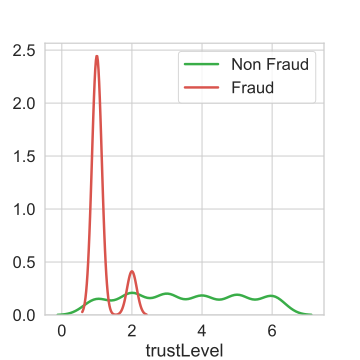
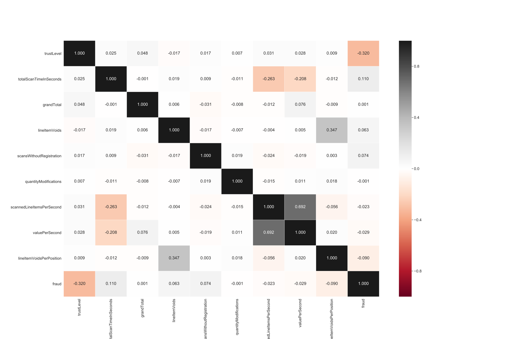
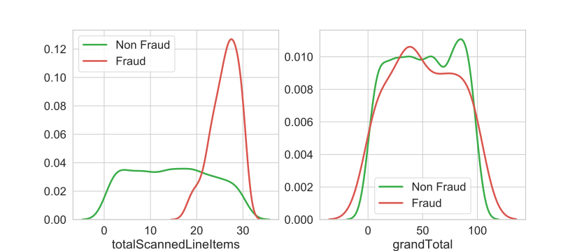
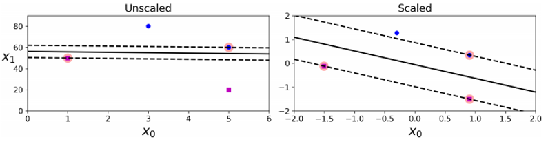

# DATA MINING CUP 2019

| Datum    | Alex     | Christian | Lukas    |
|----------|----------|-----------|----------|
| 05.04.19 | Kick-Off | Kick-Off  | Kick-Off |
| 09.04.19 | EPA      | EPA       | EPA      |
| 16.04.19 |          |           |          |
| 23.04.19 | Ferien   | Ferien    | Ferien   |
| 30.04.19 |          |           |          |
| 07.05.19 |          |           |          |
| 14.05.19 |          |           |          |
|          |          |           |          |

- [DATA MINING CUP 2019](#data-mining-cup-2019)
  - [Allgmein](#allgmein)
    - [Task](#task)
    - [Metrik](#metrik)
    - [Umsetzung](#umsetzung)
      - [Pandas](#pandas)
      - [Scikit-Learn](#scikit-learn)
      - [Keras](#keras)
      - [Seaborn](#seaborn)
  - [Datenset](#datenset)
    - [Features](#features)
    - [Trainings- Validierungs und Testdaten](#trainings--validierungs-und-testdaten)
  - [Feature Engineering](#feature-engineering)
    - [Validieren eines neuen Merkmals](#validieren-eines-neuen-merkmals)
      - [Verteilungs Plots und Korrelation zwischen Zielvariable und neuem Feature](#verteilungs-plots-und-korrelation-zwischen-zielvariable-und-neuem-feature)
      - [Besonderheiten](#besonderheiten)
  - [Modelle](#modelle)
    - [Baseline](#baseline)
      - [XGBoost Klassifikator](#xgboost-klassifikator)
      - [Linear Support Vector Machine](#linear-support-vector-machine)
    - [Semi-Supervised Learning](#semi-supervised-learning)
  - [Weitere Verbesserungsmöglichkeiten](#weitere-verbesserungsm%c3%b6glichkeiten)
  - [Zusammenfassung](#zusammenfassung)
## Allgmein

Der Data Mining Cup fand im Jahr 2019 bereits das 20. Mal statt und hat sich in den vergangenen Jahren zu Dem Wettbewerb im Bereich Data Mining und Machine Learning entwickelt. Veranstalter des Wettbewerbs ist die Prudysy AG. 150 Teams aus über 28 Ländern bearbeiteten eine Aufgabe aus dem Bereich Fraud-Detection im Retail Sektor. Für das Lösen der Aufgabe hatten die Teams nach der Bekanntgabe der Aufgabe 6 Wochen Zeit, bis die Ergebnisse eingereicht werden müssen. Das Team der Hochschule Karlsruhe schaffte es im ersten Teilnahme-Jahr direkt unter die Top10 Teams der Welt und war mit dem 6. Platz das beste Team aus Süddeutschland. Lediglich die Teams der Hochschule Anhalt(4. Platz) sowie der TU Chemnitz (5. Platz) konnten als deutsche Teams noch vor den Karlsruhern landen.

### Task

Die Jubiläumsausgabe des internationalen Studentenwettbewerbs hatte zum Ziel, Betrugsfälle beim mobilen Selbstscannen im Lebensmitteleinzelhandel aufzudecken. In Supermärkten kommen vermehrt sogenannte Selbstscanvorrichtungen zum Einsatz, bei denen Kunden beispielsweise mit dem eigenen Smartphone und einer supermarkteigenen App die Produkte einscannen und direkt in den Einkaufswagen legen. So wird der Weg über eine lange Kassenschlange umgangen. Untersuchungen haben aber gezeigt, dass es bei 5% der Vorgänge zu Ungereimtheiten kommt. Die Ursache, ob aufgrund von bewusstem Betrug oder von Fehlern in der Smartphone-App, ist allerdings nicht bekannt. Die Aufgabe bestand darin, einen Algorithmus zu entwickeln, der auf Basis von anonymisierten Einkaufsdaten frühzeitig erkennt, ob ein sogenannter „Fraud“ vorliegt oder nicht. Unter dem Begriff "Fraud" werden jegliche Formen von Ungereimtheiten zusammengefasst - sei es bewusster Betrug oder eben nur ein Systemfehler. 

### Metrik

Für die Evaluation wurde eine spezielle Konfusions Matrix beritgestellt, mit der die eingereichten Ergebnisse evaluiert werden.

|             |          | Actual Value |         |
|:-----------:|:--------:|:------------:|:-------:|
|             |          |   No Fraud   |  Fraud  |
| **Predictions** | No Fraud |     0.0 €    | - 5.0 € |
|             |   Fraud  |   - 25.0 €   |  5.0 €  |

Der Einzelhändler geht davon aus, dass ihm aufgrund eines Frauds im Schnitt 5 Euro verloren gehen. Decken wir diesen auf, so erhält er die 5 Euro (+5€). Wird der Betrug nicht erkannt sind die 5 Euro verloren (-5€). Wird ein treuer und aufrichtiger Kunde beschuldigt betrogen zu haben, so ist die Wahrscheinlichkeit groß den Kunden zu verlieren. In diesem Fall gehen dem Händer deswegen 25 Euro verloren.

### Umsetzung

#### Pandas

Das Projekt wurde mithilfe der Programmiersprache Python umgesetzt. Dabei wurden für die Datenhaltung sowie explorative Datenanalyse das Framework [Pandas](https://pandas.pydata.org/) durchgeführt. Diese ermöglicht einen einfacher Umgang mit dem Datenset, welches dazu in den RAM geladen wird. Es stellt neben einfachen Visualiesierung- auch Datenvorverabeitungs- und Aggregationsmethoden zur Verfügung. Pandas ist das dominierende Framework im Python Data Science Umfeld.

#### Scikit-Learn

Für die Umsetzung der Basisklassifikatoren (Siehe Kapitel [Models](#Models)) wurde die Bibliothek [Scikit-Learn](https://scikit-learn.org/stable/) benutzt. Diese stellt viele Implementierungen heutiger gängigiger Algorithmen bereit und achtet dabei besonders auf ein effizientes Ressourcenmanagment. So ermöglichen viele der angebotenen Schnittstellen ein parallelisierbares Training der Klassifikatoren.

#### Keras

[Keras](https://keras.io/) ist eine HighLevel API für Tensorflow, mit welcher neuronale Netze mithilfer einzelner Bausteine erzeugt werden können. In den ersten Versuchen wurde auch Deep Learning Methoden getestet, diese wurden jedoch auch bald schon wieder aufgrund mangelnder Performance verworfen. Wie im Kapitel [Modelle](#Models) näher erläutert wurde Keras dazu genutzt um ein Shallow Neural Net zu implementieren.

#### Seaborn

[Seaborn](https://seaborn.pydata.org/) ist eine Python Bibliothek die die weit verbreitete[ Matplotlib](https://matplotlib.org/) um einige nützliche Funktionen erweitert wenn mit Dataframes statt [Numpy-Arrays](https://www.numpy.org) gearbeitet wird. Es können trotzdem alle Grundfunktionalitäten der Matplotlib verwendet werden.

## Datenset

Für die Bearbeitung des Datensets standen 1879 annotierte Trainingssamples sowie 498.121 nicht annotierten Testsamples zur Verfügung ein Trainings- und ein Testdatenset zur Verfügung.
Für die spätere Vewenundung des Datensets mit verschiedenen Klassifikatoren wurden die Daten zusätzlich in einer skalierten Version abgespeichert. Skaliert wurde mithilfe des [Standard Scalers von Scikit-Learn](https://scikit-learn.org/stable/modules/generated/sklearn.preprocessing.StandardScaler.html) anhand des Mittelwerts und der Varianz.

### Features

Die Samples des Trainingsdatensets enthalten die im folgenden azfgezählten Features. Im Testdatenset fehlt die Zielvariable *fraud*.

|    Column Name                 |    Description                                                                                  |    Value Range                                                  |
|--------------------------------|-------------------------------------------------------------------------------------------------|-----------------------------------------------------------------|
|    trustLevel                  |    A customer’s individual trust level. 6:   Highest trustworthiness                            |    {1,2,3,4,5,6}                                                |
|    totalScanTimeInSeconds      |    Total time in seconds between the first   and last product scanned                           |    Positive whole number                                        |
|    grandTotal                  |    Grand total of products scanned                                                              |    Positive decimal number with maximum   two decimal places    |
|    lineItemVoids               |    Number of voided scans                                                                       |    Positive whole number                                        |
|    scansWithoutRegistration    |    Number of attempts to activate the   scanner without actually scanning anything              |    Positive whole number or 0                                   |
|    quantityModification        |    Number of modified quantities for one   of the scanned products                              |    Positive whole number or 0                                   |
|    scannedLineItemPerSecond    |    Average number of scanned products per   second                                              |    Positive decimal number                                      |
|    valuePerSecond              |    Average total value of scanned products   per second                                         |    Positive decimal number                                      |
|    lineItemVoidsPerPosition    |    Average number of item voids per total   number of all scanned and not cancelled products    |    Positive decimal number                                      |
|    fraud                       |    Classification as fraud (1) or not   fraud (0)                                               |    {0,1}                                                        |
### Trainings- Validierungs und Testdaten

Über die Dauer des Data Mining Cups hinweg wurden verschiedene Varianten des Datensets verwendet. Für das Trainieren der Klassifikatoren und dem Messen der Performance wurde ausschließlich auf das bereitgestellte Trainingsset mit 1879 Samples verwendet. Das Testset kam lediglich beim Trainieren eines [Semi-Supervised Learning Ansatzes](#semi-supervised-learning) zum Einsatz. Im frühen Zustand wurde mit einem einfachen Trainings/Validierungs Split mit einem Verhältnis 80/20  gearbeitet. Mithilfe von diesem wurden die Baselineklassifikatoren gewählt. Später zeigten Tests, dass das Ergebnis des Klassifikators extrem vom jeweiligen Trainings/Validierungs Split abhängt. Aus diesem Grund wurden zukünftige Versuche mithilfe eine 5-fold Cross Validation Tests durchgeführt. Aufgrund der Varianz des DMC Scores gegenüber der Anzahl der verwendeten Samples musste gewährleistet werden, dass wir hier ebenfalls eine 80/20 Verteilung beibehalten, sodass die Ergebnisse vom festen Train/Val Split weiter beibehalten werden können. 
Bei der Ermittlung der Performance eines Semi-Supervised Ansatzes im späteren teil wurde das Datenset fest in Trainings- und Testdaten gesplittet. Diese Testdaten dienten zur Validierung und wurden zu keinem Zeitpunkt für ein Training des Semi-Supervised Ansatzes verwendet. Die Klassifikatoren selbst wurden dann mithilfe eines Cross-Validation Ansatzes auf dem Trainingsset trainiert. Nur so konnten vergleichbaren Ergebnisse garantiert werden.
## Feature Engineering

Um einen ersten groben Überblick zu erhalten wurden das Trainings- und das Testdatenset in Form eines [`Pandas.Dataframe`](https://pandas.pydata.org/pandas-docs/version/0.23.4/generated/pandas.DataFrame.html) eingelesen.

Mit dem Befehl `Dataframe.describe()` erhält man eine Übersicht über die vorhandenen Merkmale und deren Ausprägungen.

|                           |   count |        mean |        std |         min |          25% |         50% |         75% |        max |
|:--------------------------|--------:|------------:|-----------:|------------:|-------------:|------------:|------------:|-----------:|
| trustLevel                |    1879 |   3.40181   |   1.7094   | 1           |   2          |   3         |    5        |    6       |
| totalScanTimeInSeconds    |    1879 | 932.153     | 530.145    | 2           | 474.5        | 932         | 1397        | 1831       |
| grandTotal                |    1879 |  50.8645    |  28.9402   | 0.01        |  25.965      |  51.21      |   77.285    |   99.96    |
| lineItemVoids             |    1879 |   5.46993   |   3.45117  | 0           |   2          |   5         |    8        |   11       |
| scansWithoutRegistration  |    1879 |   4.9042    |   3.1397   | 0           |   2          |   5         |    8        |   10       |
| quantityModifications     |    1879 |   2.52528   |   1.69547  | 0           |   1          |   3         |    4        |    5       |
| scannedLineItemsPerSecond |    1879 |   0.0581375 |   0.278512 | 0.000547945 |   0.00838374 |   0.016317  |    0.032594 |    6.66667 |
| valuePerSecond            |    1879 |   0.201746  |   1.24213  | 6.78887e-06 |   0.0277869  |   0.0544978 |    0.107313 |   37.87    |
| lineItemVoidsPerPosition  |    1879 |   0.745404  |   1.32724  | 0           |   0.16       |   0.35      |    0.666667 |   11       |
| fraud                     |    1879 |   0.0553486 |   0.22872  | 0           |   0          |   0         |    0        |    1       |

Bei Betrachtung der Verteilung der Zielvariable fällt schnell auf, dass sich unter den *fraud*-Fällen ledliglich Samples mit einem *trustLevel* <= 2. Dies kann sehr gut mithilfe eines `distplot` der [Seaborn-Bibliothek](#Seaborn) visualisiert werden (Siehe Abbildung)



Ein Blick auf die Korrelationsmatrix bestätigt auch die erste Vermutung, dass dieses Mermal in Korrelation zur Zielvariable *fraud* aufweisst. Leider gibt der Veranstaler keine weitere Informationen über die Entstehungen an, sondern nur, dass je kleiner das *trustLevel*, desto niedriger auch das Vertrauen in den Kunden, wobei die Variable lediglich ganzzahlige Werte im Intervall von (0,6) annehmen kann.
.


Sind bei einem Datenset, wie dem hier Vorhandenen, Features vorhanden die eine Aussage pro Zeiteinaht geben sowie welche die einen festen Zeitraum abstecken, so lassen sich weitere Features durch deren Kombination erzeugen. Verschiedene Test haben aber gezeigt, dass nur die Hinzunahme des Features *totalScannedLineItems*, welches ein Produkt aus *totalScanTimeInSeconds* und *scannedLineItemsPerSecond* eine Verbesserung beim Baseline Klassifikator bringt (Siehe Abschnitt [Baseline](#Baseline)).

Die Funktion `Dataframe.describe()` liefert für das neue Feature den folgenden Output:
|                           |   count |        mean |        std |         min |          25% |         50% |         75% |        max |
|:--------------------------|--------:|------------:|-----------:|------------:|-------------:|------------:|------------:|-----------:|
| totalScannedLineItems     |    1879 |  15.3832    |   8.70741  | 1           |   8          |  15         |   23        |   30       |

Das neue Feature nimmt also diskrete Werte im Intervall [1,30] an und sind einigermaßen gleichverteilt.

### Validieren eines neuen Merkmals

Um ein neues Merkmal zu validieren wurden mehrere Routinen durchgeführt, die sicherstellen, dass dieses Merkmal auch tatsächlich eine Verbesserung herbeiführt.

#### Verteilungs Plots und Korrelation zwischen Zielvariable und neuem Feature
Viele der State-of-the-Art Klassifikatoren arbeiten direkt oder indirekt mit der Verteilung einer Variable. Ist eine Verteilung für eines Merkmals für unterschiedliche Werte der zu vorhersagenden Variable sehr unterschiedlich, so kann dies ein Indikator für eine hohe Trennungswirksamkeit sein. Die neu gefundene Variable *totalScannedLineItems* weist unter Berücksichtigungd des Features *fraud* beispielsweise eine Verteilung wie in der folgenden Grafik dargestellt auf. Ein weniger trennungswirksames Merkmal wie *grandTotal* weist sowohl für Frauds als auch für Non-Frauds eine sehr ähnliche Verteilung auf.
 <br>
<sub>Abb. X: Links: Verteilung des Merkmals *grandTotal* Rechts: Verteilung des Merkmals *grandTotal* </sub>


#### Besonderheiten

je weiter das Projekt fortgeschritten war, fiel auf, dass wir es hier mit einem extrem variablen Datenset zu tun haben. Dies trat besonders bei den Cross-Validation Tests zum vorschein. Eine 5-fold CV führte bei 10 Ausführungen mit "Shuffle" zu 10 teilweise sehr unterschiedlichen Ergebnissen. So konnten zwar während der Hyperparametersuche immer wieder DMC-Scores von 60,70 oder sogar 90 beobachtet werden, jedoch war dies nur auf eine "günstige" Konstellation der Trainings- und Validierungsdaten zurückzuführen. Diese hohe Varianz in den Trainingsdaten bereitete so große Schwierigkeiten, dass entschieden wurde nicht den Klassifikator mit dem besten Ergebnis auf einzelne Score-Werte zu suchen, sondern mithilfe eigens entwickelter Validierungsfunktionen den robustesten Klassifikator zu wählen.


## Modelle
Zu Beginn des Wettbewebs wurden verschiedene Klassifikatoren aus der ML Bibliothek "Scikit-Learn" auf das unpräparierte Datenset angewandt. Hierbei hoben sich bereits zwei Klassifikatoren deutlich von den anderen ab. AdaBoost (15 DMC Score) und eine lineare Support Vector Machine (30 DMC Score). Das Verwenden des XGBoost Klassifikators, welcher im Kern die gleiche Funktionalität wie der AdaBoost besitzt, brachte eine weitere Verbesserung um 25 Punkte, auf 40 Punkte im DMC Score.

| Klassifikator          | DMC-Score |
|------------------------|-----------|
| KNN(K=3)               | -340      |
| **Linear SVM**            | **30**        |
| SVM with RBF-Kernel     | -115      |
| Decision Tree          | -85       |
| Random Forest          | -85       |
| Multilayer Perceptron  | -40       |
| **AdaBoost**               | **15**        |
| Naive Bayes            | -680      |
| Quadr. Discr. Analysis | -505      |
| **XGBoost** | **40** |


### Baseline

Bereits in einem frühen Stadium des Projekts ist es wichtig, sich für einen oder mehrere Baselineklassifikatoren zu entscheiden. Diese dienen während des gesamten Projekts als Indikator für gute oder schlechte Entscheidungen hinsichtlich neuer Ergebnisse. Es gilt jedoch zu beachten, dass diese Klassifikatoren bei Bedarf jederzeit durch bessere erstzt werden können. Beim Data Mining Cup haben wir  uns für 2 Basisklassifikatoren entschieden (siehe Einleitung [Modelle](#modelle)), da diese alle anderen getesteten Klassifikatoren mit großem Abstand übertroffen haben (Siehe [Baseline](#Baseline)).
Wird im Laufe des Wettbewerns ein neues Feature entwickelt, muss dies also mit allen Baselines und gegebenfalls auch mit anderen Klassifikatoren getestet werden, indem eine Instanz des Klassifikators mit Daten inklusive den neuen Features, und eine Instanz ohne das neue Feature trainiert wird. Liefert der Klassifikator mit dem neuen Feature bessere Ergebnisse als der ohne das neue Feature, so spricht dies dafür, dass ein weitere trennungswirksames Merkmal gefunden wurde, dass zur Verbesserung der Resultate beitragen kann.

#### XGBoost Klassifikator
Als einer der beiden Baselineklassifikatoren wurde der Gradienten Boosting Algorithmus [XGBoost](!https://xgboost.readthedocs.io/en/latest/) gewählt. Dieses ist in der gleichnamigen Pythonbibliothek enthalten und zeichnet sich neben seiner enorm effizienten Programmierung auch durch eine hohe Modifizierbarkeit aus. Neben dem eigenen Datenformat *DMatrix* können auch Numpy Arrays verwendet werden. Als Klassifikator kam der [XGBClassifier](!https://xgboost.readthedocs.io/en/latest/python/python_api.html#xgboost.XGBClassifier) zum Einsatz. Verschiedene Tests zeigten, dass folgende Parameter für den Fall des Data Mining Cup relevant sind:
``` python
params = {
    "max_depth": randint(2, 6),  # default 3
    "n_estimators": randint(200, 450),  # default 100
    "learnin_rate" :  uniform(0.1, 0.7),
    "gamma" : uniform(0,2),
    "min_child_weight" : uniform(0,50),
    "max_delta_step" : uniform(0,10), #Set it to value of 1-10 might help control the update.
    "reg_lambda" : uniform(0.1,2),
}
```
Für die Suche nach den optimalen Parametern wurde [*sklearn.model_selection.RandomizedSearchCV*](!https://scikit-learn.org/stable/modules/generated/sklearn.model_selection.RandomizedSearchCV.html#sklearn-model-selection-randomizedsearchcv) verwendet. Die randomisierte Suche nach einer Verteilung hat den Vorteil, gegenüber einer herkömmlichen [Grid Search](!https://scikit-learn.org/stable/modules/generated/sklearn.model_selection.GridSearchCV.html#sklearn-model-selection-gridsearchcv), dass lediglich ein Intervall vorgegeben werden muss, in dem sich der Parameterwert befinden soll. So kann eine viel genauere Suche duchgeführt werden, die sich nicht in einem diskreten Bereich abspielt. Es empfiehlt sich trotzdem eine anfängliche GridSearch für einzelne Parameter durchzuführen, um ein Gefühl für sinnvolle Werte zu bekommen.

Die Hyperparametersuche wurde auf dem Trainingsdatensatz in Verbindung mit einer 5-fold Cross Validation durchgeführt. Sie ist außerdem parallelisierbar, profitiert also von Mehrkernprozessoren. Diese randomisierte Suche kann wie folgt durchgeführt werden:

``` python
from xgboost import XGBClassifier
from scores import scores
#Defining multiple scores wich scould be tracked in hyper parameter search
score = scores.Scores()
scoring = {'AUC': 'roc_auc', 'FBeta': metrics.make_scorer(metrics.fbeta_score, beta=0.5172), "Precision":'precision', "Recall": 'recall', "AP": score.average_precision, "DMC" : score.dmc_score}

# Create classifier instance
default_xgb = XGBClassifier(booster="gbtree",tree_method='gpu_hist', disable_default_eval_metric=1,objective='binary:logistic',eval_metric='aucpr', n_gpus=1, verbosity=2)

params = {
    "max_depth": randint(2, 6),  # default 3
    "n_estimators": randint(200, 450),  # default 100
    "learnin_rate" :  uniform(0.1, 0.7),
    "gamma" : uniform(0,2),
    "min_child_weight" : uniform(0,50),
    "max_delta_step" : uniform(0,10), #Set it to value of 1-10 might help control the update.
    "reg_lambda" : uniform(0.1,2),
}
# Create RandomizedSearchCV instance and fir the data
search = RandomizedSearchCV(default_xgb, scoring=scoring, param_distributions=params, random_state=42, n_iter=20000,
                            cv=3, verbose=1, n_jobs=-1, return_train_score=True,refit='DMC')
search.fit(train_complete_X_unscaled_df, train_complete_y_df)
results = search.cv_results_

```
Der *refit* Parameter gibt an, nach welchem der vorher definierten Metriken die finale Auswahl der Parameter stattfinden soll.


 Die Ergebnisse der RandomizedSearchCV sehen wie folgt aus:

``` python
XGBClassifier(base_score=0.5, booster='gbtree', colsample_bylevel=1,
    colsample_bytree=1, disable_default_eval_metric=1,
    eval_metric='aucpr', gamma=0.8785511762914533,
    learnin_rate=0.6349847443673119, learning_rate=0.05,
    max_delta_step=8.564303568772093, max_depth=3,
    min_child_weight=1.3399467345621474, n_estimators=448,
    n_gpus=1, n_jobs=1,  objective='binary:logistic',
    random_state=42, reg_alpha=0, reg_lambda=0.16733567917931627,
    scale_pos_weight=1, silent=True, subsample=1,
    tree_method='gpu_hist', verbosity=2)

```
Die Hyperparametersuche führte zu minimal besseren Klassifikationsergebnissen, sodass im Mittel ein DMC Score von **42.0** erreicht werden konnte.

#### Linear Support Vector Machine
Wie erste Tests zeigten, performt eine Support Vector Machine mit linearem Kernel besonders gut auf dem Datensatz des Data Mining Cups. Aus diesem Grund wurde die Scikit-Learn Implementierung des Support Vector Classifiers [*sklearn.svm.SVC*](!https://scikit-learn.org/stable/modules/generated/sklearn.svm.SVC.html#sklearn-svm-svc) verwendet. Hierbei wurde als Kernel der lineare Kernel. Statt der bereits vorhandenen Klasse *linearSVC* wurde auf die Basisimplementierung `SVC(kernel='linear')` zurückgegriffen, da diese mehe möglichkeiten hinsichtlich Paralellisierung sowie Verwendung modifizierter Funktionen bietet. Da Support Vector Machines deutlich besser auf skalierten Daten arbeiten, wurde das ursprüngliche Datenset anhand des Mittelwerts und der Varianz skaliert. Dass SVM skalierungssensitiv sind, ist besonders gut an folgendem Beispiel zu erkennen:

<br>
<sub>Abb. X: Links: Aufgrund der unskalierten Daten fällt der Trennbereich zwischen den Klassen sehr klein aus Rechts: Skalierung der Daten sorgt für bessere Separierbarkeit zwischen den Klassen </sub>

Ein Skalierung wurde hierzu auf den gesamten Daten (Trainingsdatenset(1.8k) + Testdatenset (500k)) durchgeführt. Es wurde der [`StandardScaler`](!https://scikit-learn.org/stable/modules/generated/sklearn.preprocessing.StandardScaler.html#sklearn-preprocessing-standardscaler) von Scikit-Learn verwendet.

Analog zur Hyperparametersuche des XGBoost Klassifikators wurde eine `RandomizedSearchCV` auf skalierten Daten für die Support Vector Machine durchgeführt. Die folgenden Parameter sollten gesucht werden:

``` python
params = {
    "tol": uniform(1e-5, 1e-1),  # default 100
    "C" :  uniform(0.0, 80.0),
    "shrinking" : [True, False]
}
```

Die genaue Beschreibung der Parameter können der Dokumentation von Scikit-Learn entnommen werden: https://scikit-learn.org/stable/modules/generated/sklearn.svm.SVC.html#sklearn-svm-svc

Die Hyperparamtersuche kann wie folgt implementiert werden:

``` python
import pandas as pd
import numpy as np
from sklearn.svm import SVC, LinearSVC
from sklearn import metrics
from sklearn.model_selection import train_test_split
from scores import scores

score = scores.Scores()
scoring = {'AUC': 'roc_auc', 'FBeta': metrics.make_scorer(metrics.fbeta_score, beta=0.5172), "Precision":'precision', "Recall": 'recall', "AP": score.average_precision, "DMC" : score.dmc_score}

params = {
    "tol": uniform(1e-5, 1e-1),  # default 100
    "C" :  uniform(0.0, 80.0),
    "shrinking" : [True, False]
}

default_svm = SVC(kernel="linear", probability=True, cache_size=8000,  verbose=0, random_state=42)

search = RandomizedSearchCV(default_svm, scoring=scoring, param_distributions=params, random_state=42, n_iter=10000,
                            cv=3, verbose=1, n_jobs=-1, return_train_score=True,refit='DMC')
search.fit(train_complete_X_scaled_df, train_complete_y_df)
results = search.cv_results_

```

Die SVM profitierte von der automatisierten Hyperparametersuche deutlich, sodass ein DMC-Score von 61.0 gegenüber dem ersten Wert von 15 erreicht werden konnte. 

Die finalen Parameter für die SVM auf Basis von skalierten Daten sind die Folgenden:

``` python
SVC(C=11.439334564226868, cache_size=8000, class_weight=None, coef0=0.0,
    decision_function_shape='ovr', degree=3, gamma='auto_deprecated',
    kernel='linear', max_iter=-1, probability=True, random_state=42,
    shrinking=False, tol=0.08370638742373739, verbose=0)
```

### Semi-Supervised Learning
## Weitere Verbesserungsmöglichkeiten


## Zusammenfassung